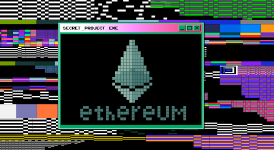

파이콘코리아의 선례를 따라 한국 내 이더리움의 커뮤니티 증진을 위하여 비영리 목적의 이더리움 개발자 컨퍼런스인 [이드콘 한국(ETHCon Korea)](https://ethcon.kr/)이 생겼었습니다. 2019년에 설립된 것 같은 이드콘은 오프라인으로 진행되던 행사이지만 코로나 사태로 인해 이번 이드콘은 다른 컨퍼런스와 마찬가지로 **온라인**으로 진행되었습니다. 온라인으로 전환과 더불어 작년과 달라진 점은 **해커톤**이 추가 되었다는 것 같습니다.(작년 이드콘 홈페이지에서는 해커톤에 관련한 내용을 찾아볼 수 없네요!)

## 해커톤👨‍💻

이드콘은 컨퍼런스와 해커톤을 진행하며 저는 이중에 해커톤에 참여했었습니다. (블록체인에 아무런 지식 없이🤪)

### 해커톤 주제



해커톤의 주제는 이더리움 생태계가 마주하고 있는 문제들을 같이 해결해보는 것으로 [ESP(이더리움 재단 펀딩 프로그램)](https://esp.ethereum.foundation/en/wishlist/) 위시리스트를 참고하시면 됩니다.

### 해커톤 특전

- 전원

  - 암호학, 이더리움기초, 영지식증명, Layer2, ETH2.0에 대한 무료 집체 교육 진행
  - 업계 개발자들 + 이더리움 재단 개발자들로부터 위시리스트 솔루션에 대한 멘토링 진행
  - 이드콘 한국 2020 참가 기념 NFT

- 수상자
  - ESP(이더리움 재단 펀딩 프로그램) 서류 심사 멘토링
    - 상금
      - 1위: 7백 만원
      - 2위: 5백 만원
      - 3위: 3백 만원
      - 테마별: Usability/Privacy/Scalability/Game/DeFi 각 1백 만원. 부문이 많아질 경우 (5백만원 / 부문수)로 상금 수여
  - 기부자상(TBD): 기부자께서 직접 선정하는 상

위와 같이 많은 상들이 준비되어 있었습니다. 하지만 블록체인에 대한 지식은 거의 전무했어서 이드콘에서 진행한 **집체교육**을 받을 수 있는 기회 그리고 군대 가기전에 뭐라도 하나 더 할 수 있는 기회라고 보고 완주를 하는 것을 목적으로 도전했었습니다.💪

### 해커톤 집체교육

```js
import React, { useReducer } from "react"
import useDarkMode from "use-dark-mode"

import initialState from "./initialState"
import reducer from "./reducer"

export const GlobalStateContext = React.createContext()
export const GlobalDispatchContext = React.createContext()
export const GlobalDarkModeContext = React.createContext()

const GlobalContextProvider = ({ children }) => {
  const darkMode = useDarkMode(false, {
    classNameDark: "dark",
    classNameLight: "light",
  })

  const [state, dispatch] = useReducer(reducer, initialState)
  return (
    <GlobalStateContext.Provider value={state}>
      <GlobalDispatchContext.Provider value={dispatch}>
        <GlobalDarkModeContext.Provider value={darkMode}>
          {children}
        </GlobalDarkModeContext.Provider>
      </GlobalDispatchContext.Provider>
    </GlobalStateContext.Provider>
  )
}

export default GlobalContextProvider
```
